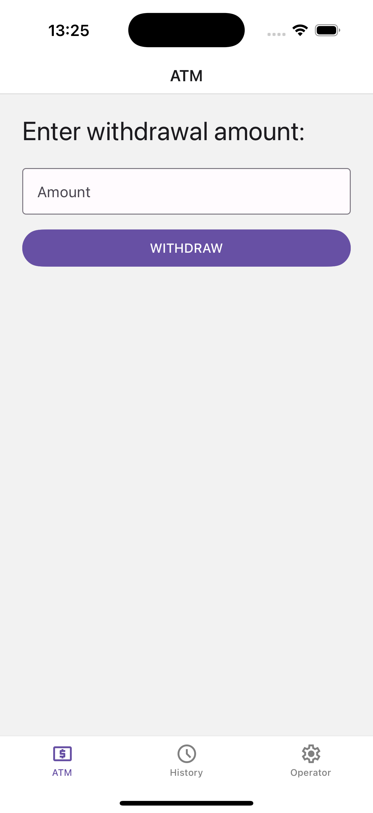
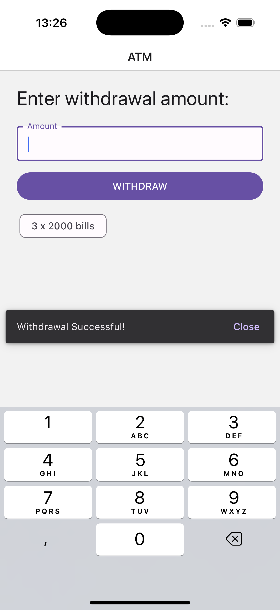
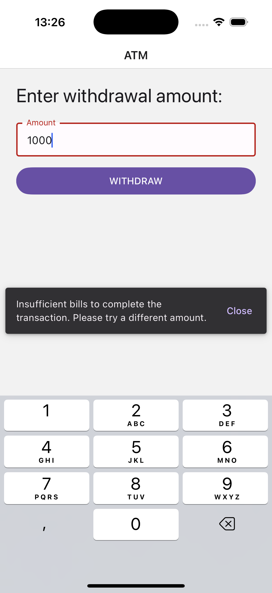
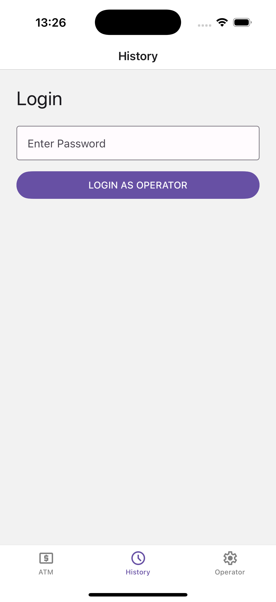
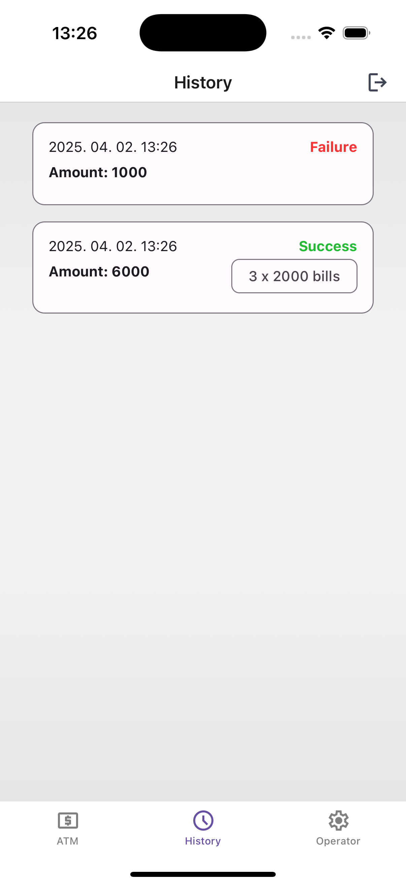
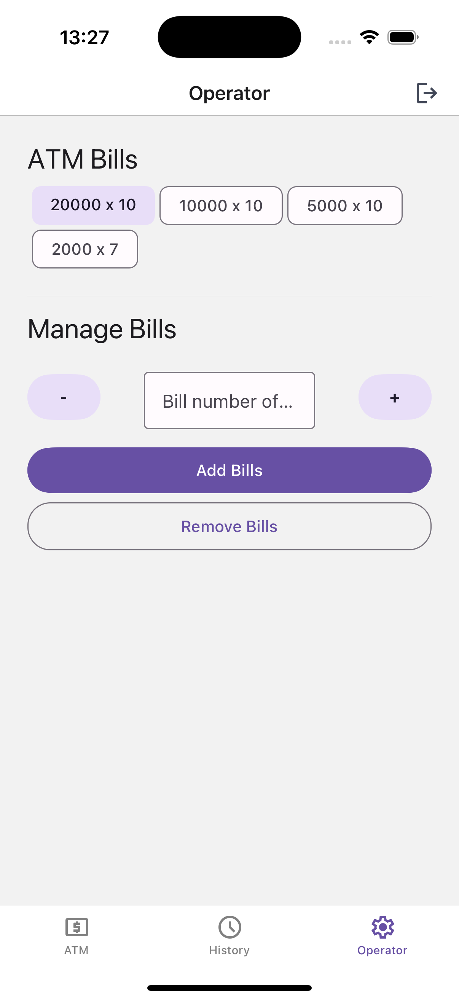

# Peak

## Introduction

This Nx repository was created for the **PEAK interview task**. It contains a **React Native app** and shared **TypeScript types** for modular and scalable development.

## Project Structure

- `apps/atm/` - The main **React Native application**.
- `libs/shared-types/` - A **shared library** for TypeScript types, used across different parts of the project.
- `node_modules/` - Dependencies for the workspace.
- `package.json` - Project dependencies and scripts.
- `tsconfig.base.json` - TypeScript configuration for the monorepo.

---

## Setup & Running the Project

### 1️⃣ Install Dependencies

Make sure you have **Node.js** and **Yarn** or **npm** installed. Then, install all dependencies:

```sh
npm install  # or yarn install
```

### 2️⃣ Running the React Native App

To start the development server for the ATM app, run:

```sh
cd apps/atm
npx react-native start --reset-cache
```

To run the app on an **iOS simulator**:

```sh
cd apps/atm/ios
pod install
cd ../..
npx react-native run-ios
```

To run the app on **Android**:

```sh
npx react-native run-android
```

After the app run you can login as operator with `1234` password.

### 3️⃣ Running with Nx

Alternatively, you can use **Nx CLI** to serve the app:

```sh
npx nx serve atm
```

To build a production-ready bundle:

```sh
npx nx build atm
```

To view available tasks:

```sh
npx nx show project atm
```

### 4️⃣ Running TypeScript Library

The `shared-types` library contains TypeScript types and does not need to be manually run. However, you can build it using:

```sh
npx nx build shared-types
```

---

## Screenshots

Here are some previews of the app:

### ATM Screen



### ATM Success Screen



### ATM Error Screen



### Login Screen



### History Screen



### Operator Screen



---

## Useful Links

- [Nx Documentation](https://nx.dev/)
- [React Native Documentation](https://reactnative.dev/)
- [Nx React Native Plugin](https://nx.dev/nx-api/react-native)
- [Join the Nx Community](https://go.nx.dev/community)

---

This project is structured for scalability and modular development using **Nx** and **React Native**. 🚀
